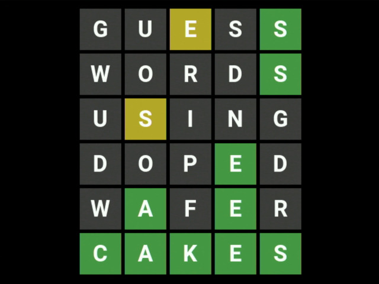

# Asicle

Okay, so Wordle took the net by storm and was ported to a myriad of platforms including retro computers and
microcontrollers with tight constraints. But have you played it on raw silicon yet?

After tapeout using the [OpenLane](https://github.com/The-OpenROAD-Project/OpenLane) flow and the
[Caravel](https://github.com/efabless/caravel) harness, put the manufactured chip on a board with 6 push buttons,
a VGA connector through resistor ladders as well as the usual Caravel requirements (voltage regulator, clock source,
flash memory & passives) and start playing.

Sources live in `verilog/rtl`:
- `display.v` is responsible for showing the game screen. It builds on `vga.v` for interfacing with VGA hardware,
  `frame.v` for the screen layout and `square.v` for rendering individual squares with letters.
- `control.v` contains code for the game logic and its inputs. It uses `wordlist.v` to generate solutions and to check whether
  words are valid, `eval.v` to calculate the square colors and `debounce.v` to separate real button presses from
  fake ones.
- `top.v` integrates the two aforementioned parts while `user_project.v` and `user_project_wrapper.v` provide
  connections to the Caravel harness
- `font.mem` contains the Apache licensed font [Roboto Bold](https://fonts.google.com/specimen/Roboto) rendered at 38 pts
- `wordlist.mem` contains a public domain [word list](https://github.com/lorenbrichter/Words)
- `picks.mem` contains indices of a selection of 1000 words to be used as solutions, filtered by removing plurals,
  past participles, proper nouns and a few obscure words and then sorting by their frequency on the English Wikipedia
